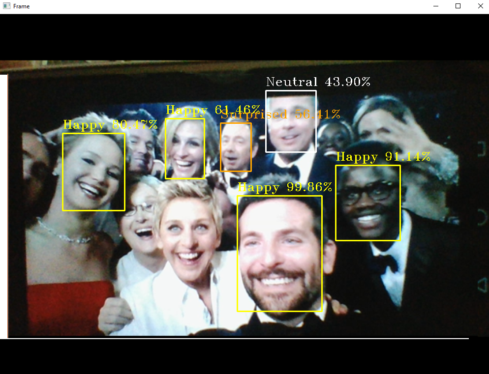

# facial_expression_recognizer

## Demo 

## Overview
This is a facial expression classifier.It includes implementation both in Keras and fastai library.The features of this classifier are: 
**1) It can detect upto 7 expressions "Afraid","Angry","Disgusted","Happy","Neutral","Sad","Surprised".**
 
**2) It can also detect multiple faces and their expression.**
 

 
**3) Had achieved validation accuracy about 68% when trained on keras and nearly 80% with one cycle policy using fastai with fine tuning on resnet50**
 

## Resources
The face detection and web camera video streaming code can be found at [https://pyimagesearch.com](https://www.pyimagesearch.com/)
 
Corresponding links
 
**1)[Face detection](https://www.pyimagesearch.com/2018/02/26/face-detection-with-opencv-and-deep-learning/)**
 
**2)[Webcamera video streamin](https://www.pyimagesearch.com/2015/12/21/increasing-webcam-fps-with-python-and-opencv/)**

